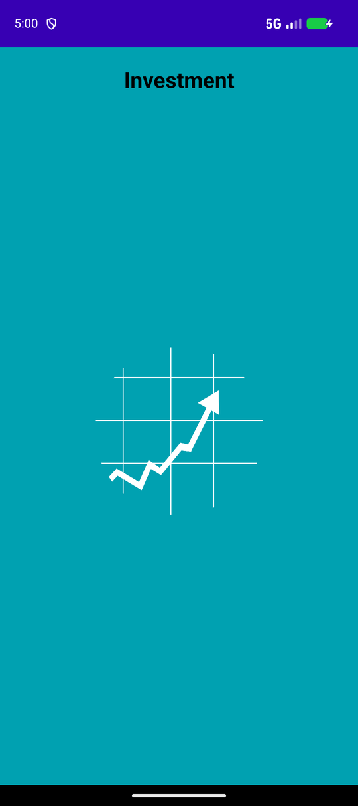
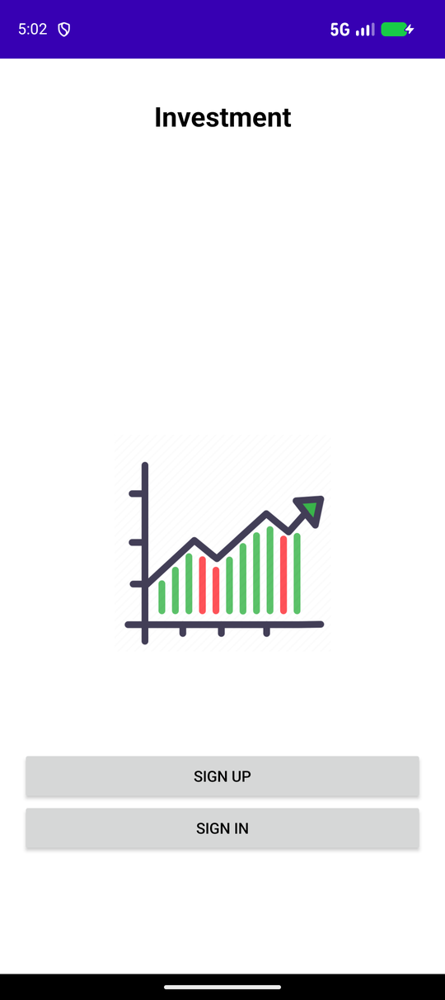
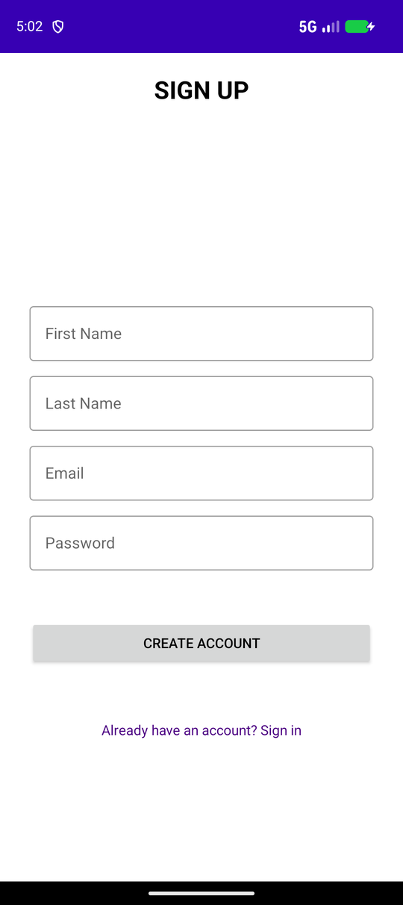
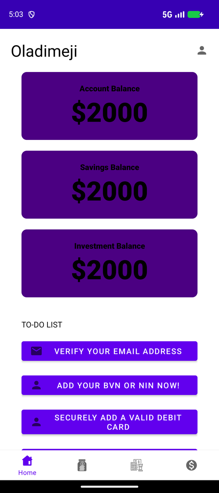
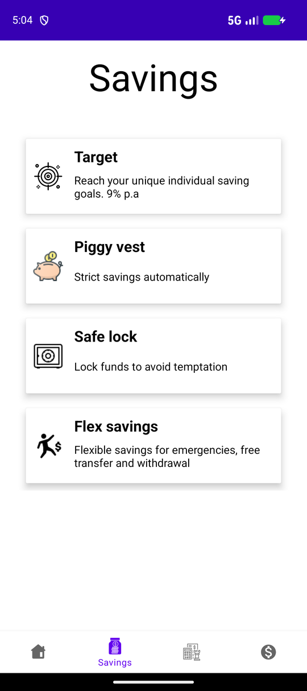
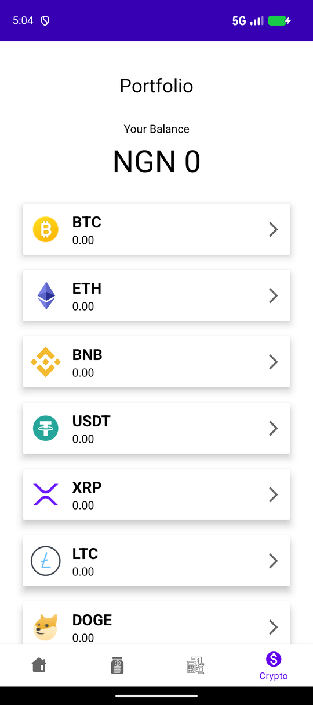

# Investment — Savings & Crypto Wallet App (Android)

A native Android app prototype for tracking account, savings and investment balances, browsing savings plans and viewing a crypto portfolio, built with Kotlin.


> **Status:** a UI prototype. Screens and navigation are fully built, but balances are sample data, sign-in / sign-up are not connected to a backend yet, and the Invest tab is a placeholder.

## Screenshots

<table>
  <tr>
    <td align="center"><br><sub>Splash</sub></td>
    <td align="center"><br><sub>Welcome</sub></td>
    <td align="center"><br><sub>Sign up</sub></td>
  </tr>
  <tr>
    <td align="center"><br><sub>Home dashboard</sub></td>
    <td align="center"><br><sub>Savings plans</sub></td>
    <td align="center"><br><sub>Crypto portfolio</sub></td>
  </tr>
</table>

## Features

- **Splash screen** with a timed transition to the welcome screen.
- **Welcome, sign-in and sign-up screens** (first name, last name, email, password).
- **Bottom navigation** between four fragments: Home, Savings, Invest and Crypto.
- **Home dashboard:** account, savings and investment balance cards, plus an onboarding to-do list (verify email, add BVN/NIN, add a debit card, link a Binance account).
- **Savings:** a RecyclerView list of savings plans (Target, Piggy vest, Safe lock, Flex savings) with icons and descriptions.
- **Crypto portfolio:** total balance in NGN and a RecyclerView of assets (BTC, ETH, BNB, USDT, XRP, LTC, DOGE…) built with a custom adapter.
- ViewBinding throughout, with Material Components and CardView layouts.

## Tech stack

| Area | Technology |
|---|---|
| Language | Kotlin |
| Platform | Android (minSdk 23, targetSdk 30, compileSdk 34) |
| UI | XML layouts, ViewBinding, Material Components, ConstraintLayout, RecyclerView, CardView |
| Navigation | Activities + Fragments with `BottomNavigationView` |
| Build | Gradle 8.13, Android Gradle Plugin 8.7 |

## Project structure

```
app/src/main/java/com/investment/
├── Splash.kt                # Splash screen (3 s timer)
├── FirstPage.kt             # Welcome screen: Sign up / Sign in
├── SignIN.kt, SignUP.kt     # Auth screens
├── FragmentHolder.kt        # Hosts the bottom navigation + fragments
├── fragments/
│   ├── Home.kt              # Balances + onboarding to-do list
│   ├── Savings.kt           # Savings plans list
│   ├── Invest.kt            # Placeholder
│   └── Crypto.kt            # Crypto portfolio list
├── adapter/
│   ├── CustomAdapter.kt         # Crypto list adapter
│   └── SavingCustomAdapter.kt   # Savings list adapter
├── cryptoItemModel.kt
└── savingItemModel.kt
```

## Getting started

**Requirements:** Android Studio (or JDK 17+) and the Android SDK (platform 34).

```bash
git clone https://github.com/Mickool17/Investment.git
cd Investment
./gradlew assembleDebug        # APK in app/build/outputs/apk/debug/
./gradlew installDebug         # install on a running emulator/device
```

You can also open the folder in Android Studio and press **Run**.

## Roadmap

- Real authentication (e.g. Firebase Auth) and persisted user profiles
- Live crypto prices from a public market API
- Build out the Invest tab
- Savings plan detail and deposit flows

## Author

**Oladimeji Micheal Tomisin** — [GitHub @Mickool17](https://github.com/Mickool17)
